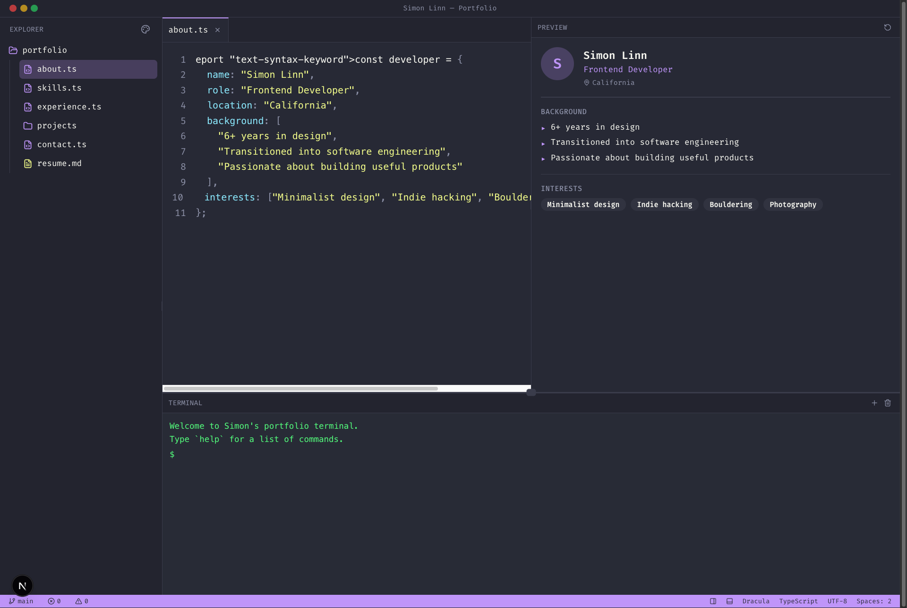

# DevIDE Portfolio

**Stand out instantly with a portfolio that looks like a real VS Code workspace.**

Most developer portfolios look the same. This one doesn't.

DevIDE turns your personal site into a fully functional-looking code editor - complete with a file explorer, editor tabs, resizable panels, a terminal, and theme switching. Recruiters open it and do a double-take. That's the point.



---

## Why This Hits Different

- **Impress recruiters in seconds** - your portfolio looks like you're already working
- **Show your skills like a real developer** - not a template, a workspace
- **No design skills needed** - the IDE layout does the heavy lifting
- **One file to customize** - all your personal content lives in `portfolio-data.ts`, that's it
- **No backend required** - deploy anywhere in minutes

> "All of your personal content lives in one file."
> That's not a feature. That's a superpower.

---

## What You Get

- VS Code-style layout: file explorer + editor tabs + live preview
- Resizable panels - feels premium, works perfectly
- Multiple built-in themes (switch with one click)
- Responsive layout for desktop and mobile
- Project previews, resume, contact, and experience sections
- Optional AI-powered file preview (Gemini / Genkit)
- Built on Next.js 15, React 19, TypeScript, Tailwind CSS

---

## Sections Included

- About
- Skills
- Experience
- Projects
- Contact
- Resume

---

## Quick Start

```bash
npm install
npm run dev
```

Runs at `http://localhost:9002`.

---

## Customization

Everything personal lives in one file:

```text
src/lib/portfolio-data.ts
```

Edit your name, role, bio, skills, experience, projects, and contact links - all in one place.

You may also want to update:

- `src/app/layout.tsx` - browser tab title and meta description
- `src/app/page.tsx` - title bar name
- `public/placeholder-images/` - your project screenshots

---

## Optional AI Feature

Includes an optional AI preview flow via Gemini + Genkit.

- The portfolio works fully without it
- To enable: add `GEMINI_API_KEY` to your `.env`

---

## Deployment

Deploy to any platform:

- **Vercel** (recommended)
- Netlify
- Firebase App Hosting

---

## Tech Stack

- Next.js 15
- React 19
- TypeScript
- Tailwind CSS
- Radix UI

---

## Documentation

Full setup, customization, and deployment guide: [setup.md](setup.md)

---

## License

See the included `LICENSE` file for distribution terms.


## Get Started

Download, customize one file, and deploy your portfolio in minutes.

No setup headaches. Just edit and ship.